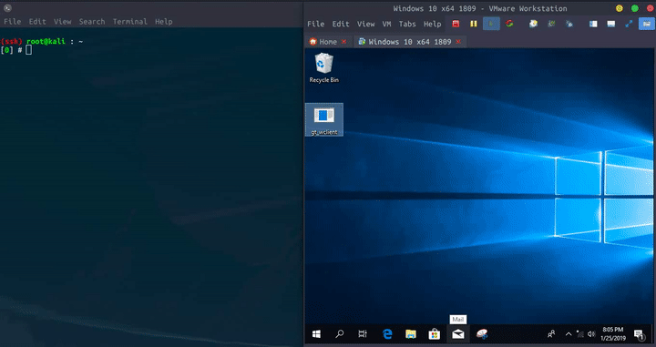

# Ghost Tunnel - Go

Golang version of [Ghost Tunnel](https://github.com/360PegasusTeam/GhostTunnel), or called Wifi Covert Channel.

Hide payload in 802.11's probe-req and beacon frame.

Compatible with 360's C++ version client.

## Demo

